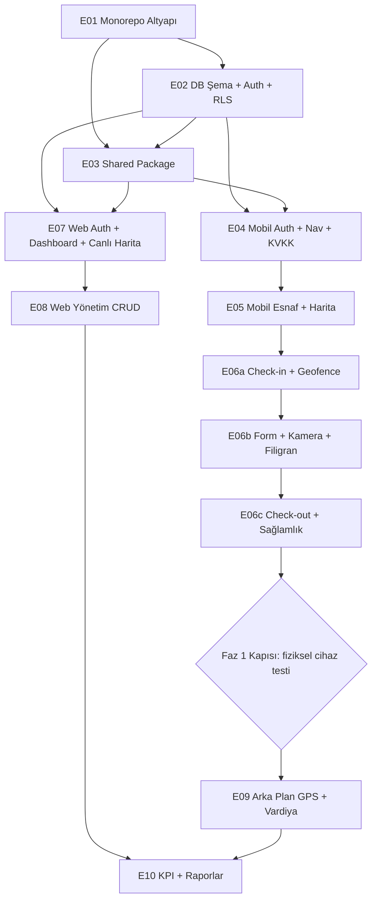

# Saha — Epic Geliştirme Planı

Bu klasör, **Saha Ekip Takip ve Pazarlama Yönetim Sistemi**'nin AI coding agent'lar ile sıfırdan geliştirilmesi için hazırlanmış epic promptlarını içerir.

- **Kapsam:** Faz 1 (MVP) + Faz 2. Faz 3 (rota optimizasyonu, bölge yönetimi, offline-first, bildirimler) bu planda **yoktur**.
- **Öncelik:** $0/ay maliyet. Bu öncelik doğrultusunda iki mimari karar alınmıştır (bkz. Karar Kayıtları).

## Nasıl Kullanılır

1. Aşağıdaki sırayla ilerle. Her epic için **yeni ve temiz bir agent oturumu** aç (önceki oturumun bağlam şişkinliğini taşıma).
2. İlgili `E0X-*.md` dosyasındaki promptun tamamını agent'a ver.
3. Agent bitince, prompttaki DOĞRULAMA komutlarını **kendin çalıştır** — agent'ın "geçti" demesine güvenme.
4. Kabul kriterleri sağlanmadan bir sonraki epice geçme; yarım epic üstüne yeni epic başlatma.

## Epic Listesi (1 Orta + 9 Küçük)

| # | Epic | Boyut | Bağımlılıklar | Hat |
|:--|:-----|:------|:--------------|:----|
| E01 | Monorepo Altyapı Kurulumu | Küçük | — | Ortak |
| E02 | Veritabanı Şeması + Auth + RLS | Küçük | E01 | Ortak |
| E03 | Shared Package (types / validation / api) | Küçük | E01, E02 | Ortak |
| E04 | Mobil — Auth + Navigasyon + KVKK Onayı | Küçük | E02, E03 | Mobil |
| E05 | Mobil — Esnaf Listesi + Harita + Detay | Küçük | E04 | Mobil |
| **E06** | **Mobil — Ziyaret Akışı (Check-in / Form / Fotoğraf / Check-out)** | **ORTA** | E05 | Mobil |
| E07 | Web — Auth + Dashboard Kabuğu + Canlı Harita | Küçük | E02, E03 | Web |
| E08 | Web — Esnaf + Kategori + Kullanıcı Yönetimi | Küçük | E07 | Web |
| E09 | Mobil — Arka Plan GPS + Vardiya (Faz 2) | Küçük | E06 + Faz 1 kapısı | Mobil |
| E10 | Web — KPI Dashboard + Raporlar (Faz 2) | Küçük | E08, E09 | Web |

## Bağımlılık Grafiği

## Çalıştırma Sırası ve Handoff Notları

| Sıra | Epic | Hat | Önkoşul | Bittiğinde sonrakine hazır olan |
|:-----|:-----|:----|:--------|:-------------------------------|
| 1 | E01 | ortak | — | Çalışan turbo pipeline, 3 app iskeleti, env şablonları, `supabase/config.toml` |
| 2 | E02 | ortak | E01 | Tüm tablolar + RLS + geofence RPC + storage bucket + seed + test kullanıcıları |
| 3 | E03 | ortak | E01, E02 | Şemayla birebir örtüşen tipler/Zod/sabitler; iki hat buradan import eder |
| 4 | E04 ∥ E07 | mobil ∥ web | E02, E03 | **Paralel başlangıç.** E04: mobil auth+tab iskeleti+KVKK onayı. E07: web giriş+kabuk+canlı harita |
| 5 | E05 ∥ E08 | mobil ∥ web | E04 / E07 | E05: esnaf listesi/harita/detay — E06 akışını tetikleyecek ekran hazır. E08: CRUD'lar+foto galeri (E06'yı beklemez) |
| 6 | E06a→b→c | mobil | E05 | Uçtan uca ziyaret akışı; web raporlarının okuyacağı gerçek veri üretilmeye başlar |
| 7 | — **Faz 1 kapısı** — | | E06, E08 | Aşağıdaki kapı kontrolü |
| 8 | E09 | mobil | E06, Faz 1 kapısı | Vardiya + konum logları akıyor |
| 9 | E10 | web | E08, E09 | KPI/rapor/CSV; Faz 2 tamam |

### E06 Alt Oturumları (orta boyut → 3 oturum)

- **E06a — Check-in:** konum izinleri + GPS alma, isMock tespiti, sunucu geofence RPC, aktif/yarım ziyaret toparlanma, ziyaret kaydı açma.
- **E06b — Form + Kamera:** sonuç + not formu, zorunlu anlık kamera (galeri yok), filigran, sıkıştırma, Storage upload.
- **E06c — Check-out + sağlamlık:** check-out (sunucu zamanı), özet ekranı, retry/idempotency, uçtan uca senaryo testi.

Her alt oturum aynı E06 promptuyla çalıştırılır; agent'a hangi oturumda olduğunu söyle (örn. "E06'yı çalıştır, oturum 6b ile başla: 6a tamamlandı").

## Paralel Hat Kuralları (çakışma önleme)

- `packages/shared`'a aynı anda **tek hat** dokunur. Kural: E04 sonrası tüm epic promptları "shared'ı değiştirme; eksik varsa 'SHARED İHTİYACI' notu düş" kısıtı içerir. Biriken ihtiyaçlar iki hat arasında ayrı bir mini shared oturumunda eklenir (diğer hat o sırada duraklar).
- Migration üretimi tekil: şema değişikliği yalnızca E02'de yapılır. Web hattı şema ihtiyacı duyarsa dur, ayrı mini epic aç.
- Klasör ayrımı: mobil hattı `apps/web`'e, web hattı `apps/mobile`'a dokunamaz (promptların KISITLAR bölümünde yazılı).

## Faz 2'ye Geçiş Kapısı (E09/E10 öncesi şart)

- Gerçek Android cihazda 1 tam ziyaret: check-in (geofence geçti) → zorunlu foto + filigran → check-out.
- Web canlı haritada ziyaretin anlık görünmesi; fotoğrafın signed URL ile açılması.
- Emülatör/kamerada yanıltıcı sonuçlar olabileceğinden E06 ve E09'un kabulü mutlaka fiziksel cihazda.
- Bu kapı geçilmeden E09'a geçme: arka plan GPS, üstüne kurulacağı ziyaret/vardiya zemini sağlam değilse boşa maliyet üretir.

## Her Epic Öncesi / Sonrası Kontroller

**Öncesi:**
- Bir önceki epic'in DOĞRULAMA adımları bizzat geçti mi?
- Yeni oturuma verilen prompt self-contained'dir (bu dosyalar öyle hazırlandı) — ek bağlam gerekiyorsa sadece "tamamlananlar" listesini sözlü teyit et.

**Sonrası:**
- DOĞRULAMA komutlarını kendin çalıştır.
- `git status` / `git diff --stat` ile değişiklik listesini gözden geçir: kapsam dışı dosyaya dokunulmuşsa geri aldır.
- Yeni migration eklendiyse `supabase db reset` + seed ile sıfırdan kurulumu test et.
- `.env.example` dışında dosyaya secret yazılmış mı diye tara.

## Hata Durumunda

- Aynı promptu hata çıktısıyla birlikte tekrar ver: "X komutu şu hatayı verdi, düzelt."
- 2 denemede düzelmezse epic'i ikiye böl veya bir önceki epic'in handoff varsayımını sorgula (örn. E02'nin RPC imzası prompttakiyle uyuşmuyor olabilir).
- Uzun hata loglarını agent'a kırpılmış ver; gerekiyorsa ilgili 20-30 satırı ilet.

## Kalite Kontrol Listesi (bir epic promptu "iyi" mi?)

1. Self-contained mı? (agent'ın başka doküman okuması gerekmiyor)
2. Tek hedef var mı ve HEDEF bölümüyle örtüşüyor mu?
3. KAPSAM DIŞI ≥ 3 madde mi ve maddeler gerçek mi?
4. Kabul kriterleri test edilebilir mi, en az 1 olumsuz senaryo içeriyor mu?
5. Doğrulama komutları birebir çalıştırılabilir mi?
6. İsimler (dosya yolları, tablo/sütun, RPC) önceden verilmiş mi?
7. Bağımlılıklar ve hazır gelen çıktılar BAĞLAM'da listelenmiş mi?
8. $0 maliyet ihlali yok mu?
9. Güvenlik kritik kontrolleri (geofence, zaman damgası, filigran) sunucuda mı istenmiş?
10. Türkçe UI / İngilizce kod ayrımı hatırlatılmış mı?
11. Kısıtlar yerinde mi? ("git commit yok", "minimal değişiklik", "mevcut migration'ları düzenleme")
12. Boyut gerçekçi mi? (küçük = tek oturum; orta = alt oturumlara bölünmüş)

## Neden Sadece E06 Orta?

E06, birbirinden bağımsız hata ayıklama döngüsü gerektiren beş riskli bileşeni tek epictе topluyor: konum servisleri (izin akışları, isMock tespiti, emülatör–gerçek cihaz farkları), sunucu geofence entegrasyonu, kamera pipeline'ı (izin, galeri yasağı, filigran, upload + retry), ziyaret durum makinesi (aktif ziyaret toparlanma) ve check-out hesapları (sunucu zamanı, süre). Tek oturumda birleştiklerinde bağlam penceresi şişer, hata ayıklama kalitesi düşer ve "yarım kalan ziyaret akışı" gibi geri dönülmesi pahalı durumlar doğar. Bu yüzden 3 alt oturuma bölündü; her alt oturum sonunda cihazda ara doğrulama yapılabilir. Diğer epic'ler tek düzlemli ve öngörülebilir olduğundan küçük kalır.

## Karar Kayıtları ($0 maliyet öncelikli)

- **Mobil harita:** `react-native-maps` **kullanılmayacak** — Android'de native Google Maps engine'i başlatır ve production build'de Google API key ister (billing hesabı = maliyet riski). Yerine: `@maplibre/maplibre-react-native` + OpenStreetMap raster tile. Sonuç: **E05'ten itibaren Expo Go yok, development build** (`npx expo prebuild` + `npx expo run:android`).
- **Arka plan GPS:** `react-native-background-geolocation` **kullanılmayacak** — Android release build ücretli lisans ister. Yerine: `expo-location` + `expo-task-manager` (%100 ücretsiz). Bilinen sınırlar (pil, OEM killed-state) E09 promptunun 10. bölümünde belgelidir.
- **Web harita:** `react-leaflet` + OSM (anahtarsız).
- **OSM tile politikası:** `tile.openstreetmap.org` düşük trafik / fair-use politikasına tabidir; atıf zorunludur. Ekip büyürse ücretsiz alternatif tile sağlayıcı veya self-host değerlendir.
- **KVKK retention:** pg_cron satırları migration'da yorumludur; hosted ortamda manuel etkinleştirme veya GitHub Actions cron + service role ile çalıştırılır. Operasyon checklist'ine ekle — unutulursa sessizce hiç çalışmaz.
- **PostGIS I/O konvansiyonu:** okumada GeoJSON `[lng, lat]`; yazmada EWKT `SRID=4326;POINT(lng lat)`. lng/lat karışıklığı en olası hatadır; her iki platformda tek adapter/helper üzerinden geçilir.
- **Realtime:** `visits` tablosu `supabase_realtime` publication'ında olmalı (E07 canlılığı için); agent DB'ye dokunmaz, gerekirse `alter publication supabase_realtime add table visits;` DB sahibince çalıştırılır. Supabase Free 200 eşzamanlı bağlantı limiti: E07 tek kanal + sıkı cleanup; E10 bilinçli olarak aboneliksiz.
